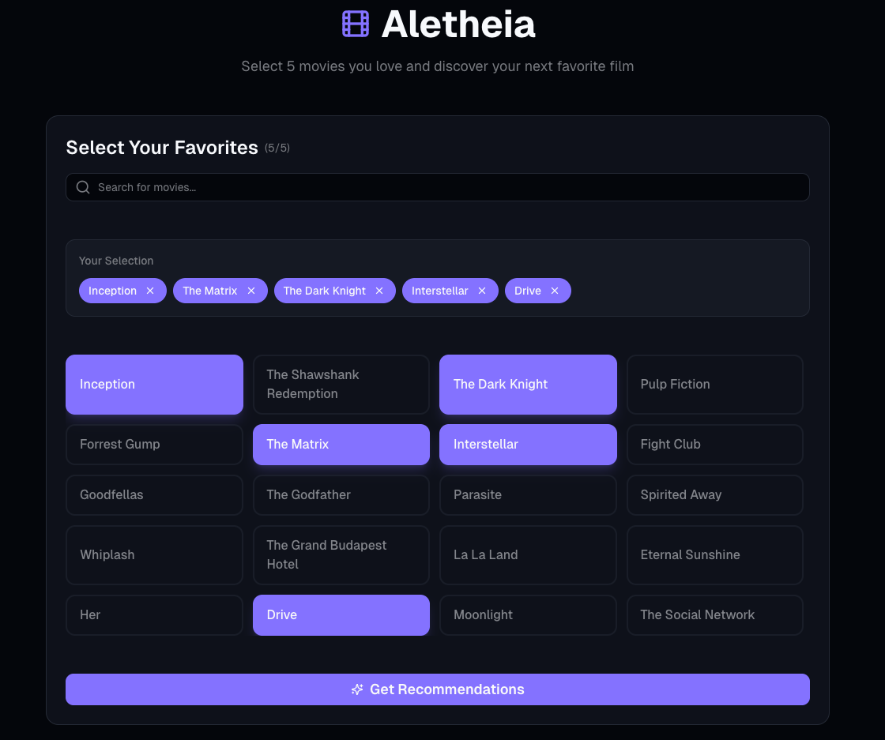
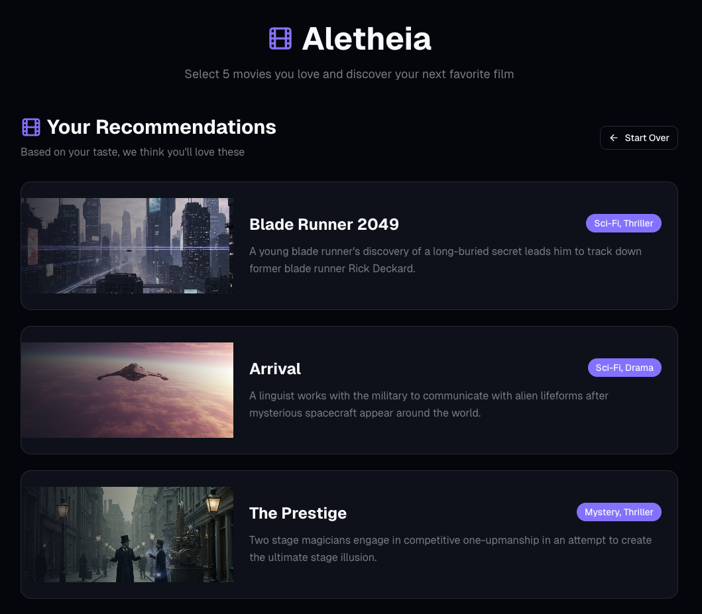

# Aletheia — Preference-Based Movie Recommendation System

Aletheia is a full-stack machine learning application that generates personalized movie recommendations from a small set of user-selected preferences. The system learns semantic item representations from historical interaction data and serves real-time recommendations through a modern web interface.

The project is designed to mirror production-style applied ML systems, combining model training, ranking-based inference, backend APIs, and a frontend product layer.

## User Interface

### Movie Selection


### Recommendations


---

## Overview

**User flow**

1. A user selects up to five movies they like
2. The system aggregates those selections into a preference representation
3. All candidate movies are scored via similarity in embedding space
4. The top-K recommendations are returned and displayed in the UI

This approach enables high-quality recommendations even without an explicit user account or historical profile.

---

## System Architecture

```
React / Next.js UI
        ↓
Node.js (Next.js API routes)
        ↓
FastAPI inference service
        ↓
PyTorch Neural Collaborative Filtering model
```

* **Frontend**: Collects user preferences and displays ranked recommendations
* **Node.js (BFF)**: Proxies frontend requests and isolates backend services
* **FastAPI**: Hosts inference logic and ranking endpoints
* **ML model**: Learns item embeddings from MovieLens interaction data

---

## Recommendation Approach

### Model

* Neural Collaborative Filtering (NCF)
* Trained on MovieLens 100K implicit feedback
* Learns dense item embeddings capturing collaborative signals

### Inference Logic

1. Retrieve embeddings for user-selected movies
2. Compute a mean preference vector
3. Score all candidate items via dot product
4. Mask already-selected items
5. Return top-K ranked recommendations

This ranking-based approach is simple, interpretable, and efficient for real-time serving.

---

## Running the Application

The application can be run locally using Docker and Docker Compose, which will start both the FastAPI backend and the Next.js frontend.

### Prerequisites

* Docker
* Docker Compose

### Build and start the services

From the project root, run:

```bash
docker compose up --build
```

This command will:

* Build the backend and frontend Docker images
* Start the FastAPI inference service
* Start the Next.js frontend

### Access the application

* Frontend: [http://localhost:3000](http://localhost:3000)
* Backend API: [http://localhost:8000](http://localhost:8000)
* API documentation: [http://localhost:8000/docs](http://localhost:8000/docs)

### Stop the services

To stop the running containers, press `Ctrl+C` or run:

```bash
docker compose down
```

---

## Tech Stack

### Machine Learning

* PyTorch
* Neural Collaborative Filtering (NCF)
* Implicit feedback modeling
* Ranking-based evaluation (Hit@K, NDCG@K)

### Backend

* FastAPI
* Python 3.11
* Poetry for dependency management
* Docker for containerization

### Frontend

* React
* Next.js (App Router)
* TypeScript
* Node.js (Backend-for-Frontend pattern)
* Vercel-ready deployment

---

## Project Structure

```
Aletheia/
├── aletheia/
│   ├── api/              # FastAPI routes, schemas, dependencies
│   ├── models/           # NCF model definition
│   ├── training/         # Training pipeline
│   ├── evaluation/       # Ranking evaluation
│   ├── data/             # Dataset utilities
│   └── utils/
├── web/                  # Next.js frontend + Node.js API routes
├── data/                 # MovieLens data
├── checkpoints/          # Trained model weights
├── Dockerfile
├── docker-compose.yml
├── pyproject.toml
└── README.md
```

---

## Running the Project Locally

### Prerequisites

* Docker
* Docker Compose

### Start the full application

```bash
docker compose up --build
```

**Services**

* Frontend: [http://localhost:3000](http://localhost:3000)
* Backend API: [http://localhost:8000](http://localhost:8000)
* API docs: [http://localhost:8000/docs](http://localhost:8000/docs)

---

## Backend API

### Health Check

```
GET /health
```

### Preference-Based Recommendation

```
POST /recommendations/preferences
```

**Request**

```json
{
  "item_ids": [1, 50, 172, 300, 127],
  "k": 5
}
```

**Response**

```json
{
  "input_items": [...],
  "recommendations": [
    {
      "item_id": 318,
      "title": "Shawshank Redemption",
      "genres": ["Drama"],
      "score": 0.87,
      "rank": 1
    }
  ]
}
```

---

## Frontend

The frontend provides:

* Movie selection interface
* Loading state with visual feedback
* Ranked recommendation display

All backend communication is handled via Next.js API routes, following a clean backend-for-frontend architecture.

---

## Evaluation

The model is evaluated using standard ranking metrics:

* Hit@K
* NDCG@K

Evaluation is performed using leave-one-out validation on MovieLens interactions.

---

## Design Goals

* Demonstrate applied ML system design, not just model training
* Emphasize ranking-based recommendation over prediction accuracy
* Separate training, inference, and product layers
* Use industry-relevant tools and patterns

---

## Future Improvements

* Cold-start handling with content features
* User-specific personalization via learned user embeddings
* Embedding visualization and analytics
* Online evaluation and A/B testing hooks
* Authentication and persistent user profiles

---

## Motivation

This project was built to practice end-to-end applied machine learning engineering, from data processing and model training to inference serving and frontend integration, using patterns common in real-world ML product teams.

---
